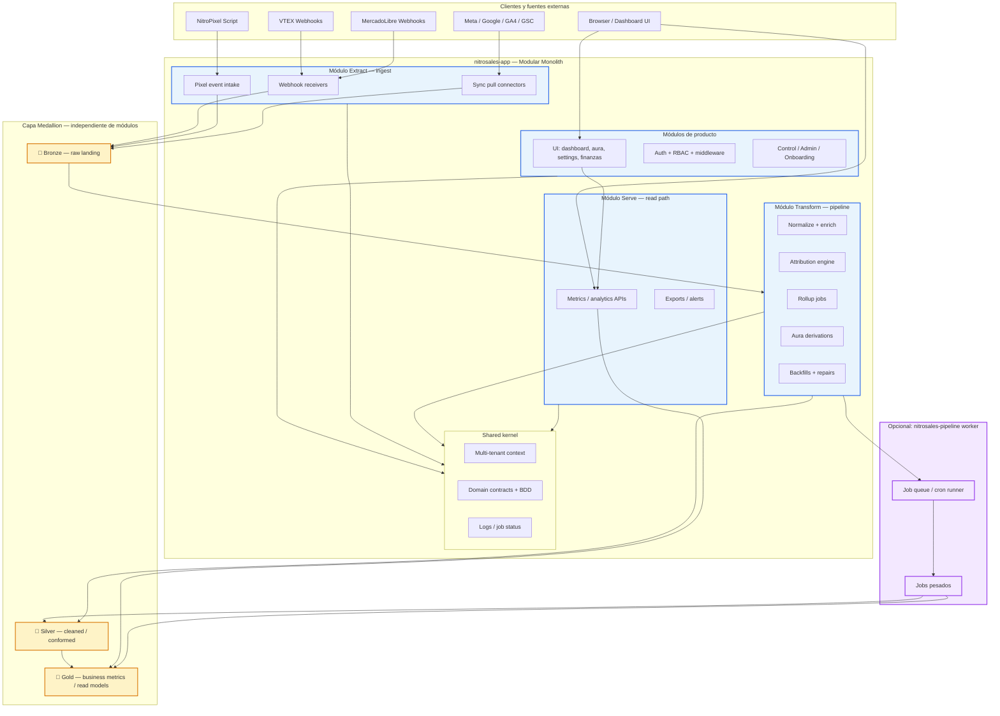
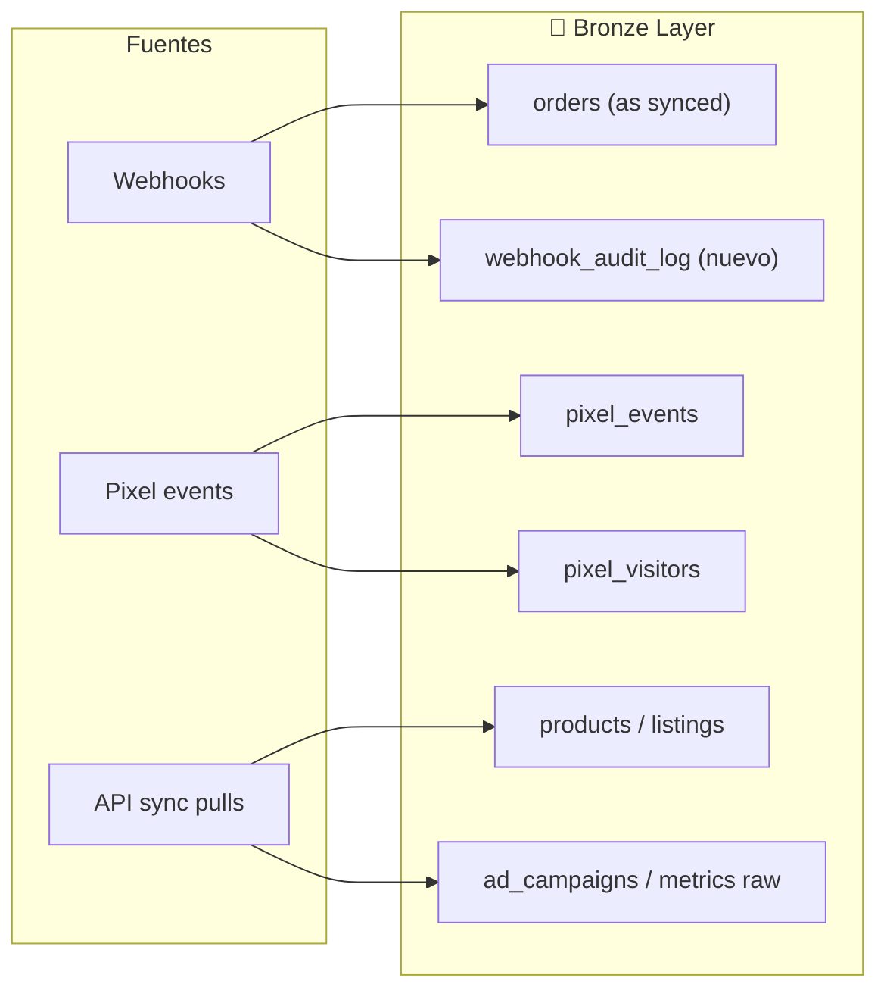
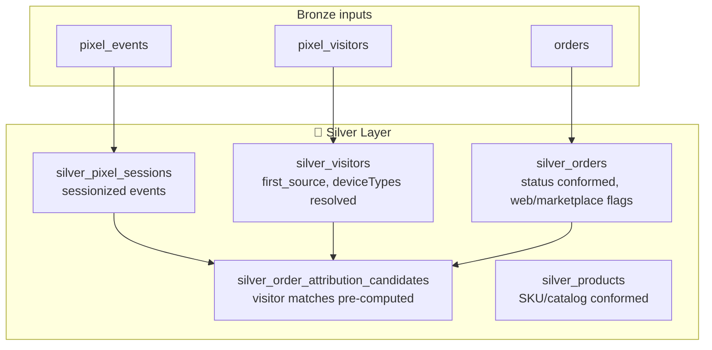
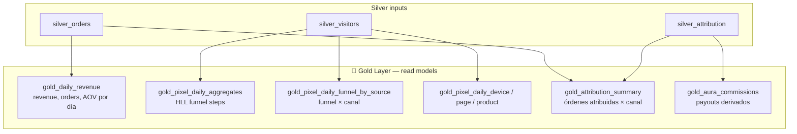
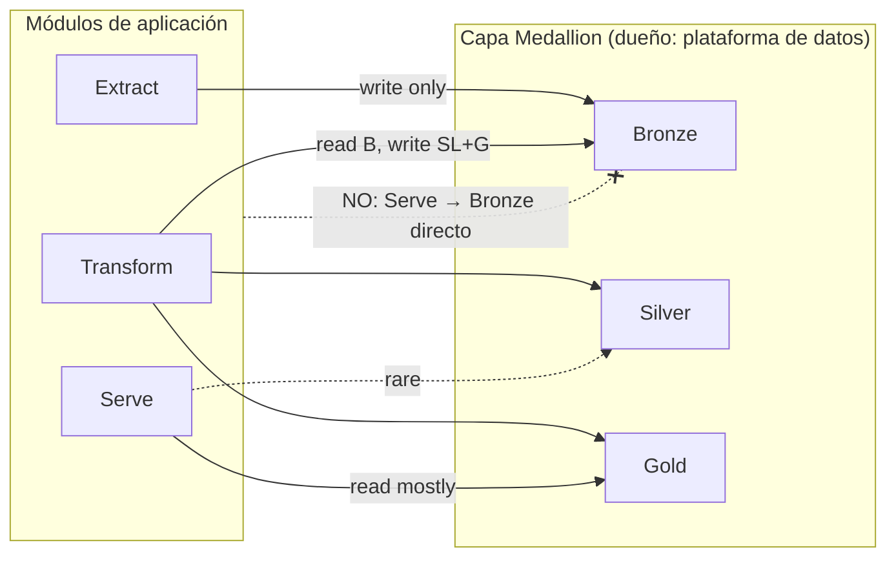
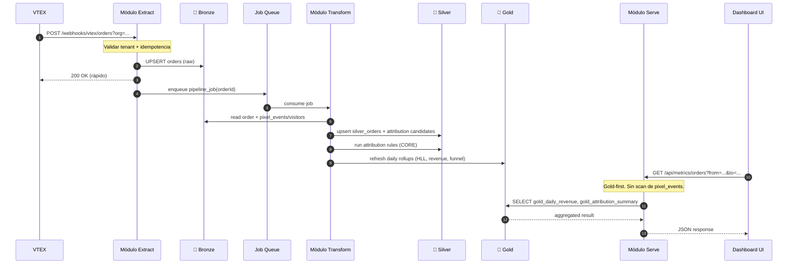
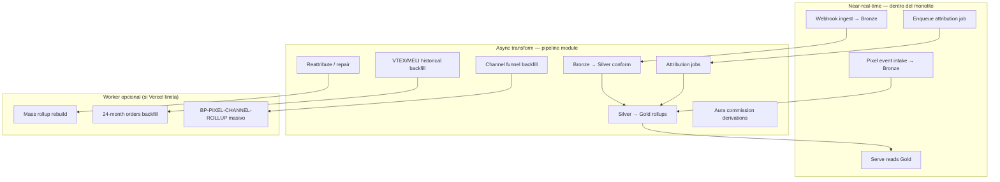
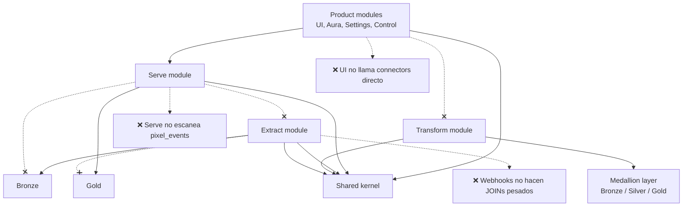
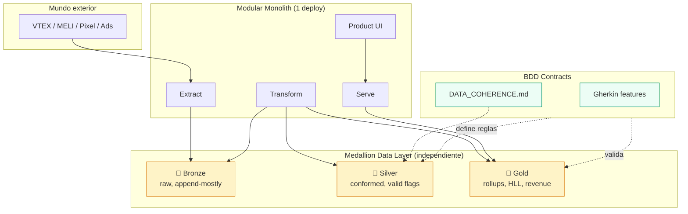

# Plan de Arquitectura — Modular Monolith + Medallion Data Layer

> **Propósito:** definir la reorganización de NitroSales sin microservicios prematuros.
> Un **monolito modular** para producto y pipelines, más una **capa de datos Medallion**
> (Bronze → Silver → Gold) que optimiza lecturas y coherencia **sin depender** de los
> módulos de aplicación.
>
> **Audiencia:** equipo técnico + founders (decisiones de arquitectura).
> **Última actualización del PLAN:** 2026-07-14

> ## ⚠️ ESTE DOCUMENTO NO REFLEJA EL ESTADO ACTUAL
>
> Decía *"Estado: propuesta — no implementado"* y tenía **todos** los checkboxes
> de las Fases 0-5 vacíos. Eso dejó de ser cierto hace semanas: buena parte de
> las Fases 1 y 2 está **en producción**.
>
> **La fuente de verdad del estado es [`MEDALLION_STATUS.md`](./MEDALLION_STATUS.md).**
> Este archivo es el DISEÑO (el porqué y el hacia dónde), no el avance.
>
> Un dev que leyera solo este plan arrancaría a construir lo que ya existe. Lo
> detectó una auditoría independiente el 2026-07-21, que además midió el avance
> real contra el código:
>
> | Fase | Real (2026-07-21) |
> |---|---|
> | 0 — docs y contratos | ~50% (inventario hecho; falta BDD: hay 1 feature de las 5-10) |
> | 1 — formalizar Gold | ~55% |
> | 2 — Silver | ~70% en superficie, ~40% en sustancia (`silver_orders.is_valid` está computado, indexado… y no lo lee ningún consumidor) |
> | 3 — modularizar (`src/modules/`) | ~10% — el directorio no existe |
> | 4 — worker · 5 — warehouse | 0%, correctamente declaradas pendientes |
>
> **Antes de tomar cualquier decisión con este plan, cruzarlo con `MEDALLION_STATUS.md`.**

---

## Tabla de contenidos

1. [Resumen ejecutivo](#1-resumen-ejecutivo)
2. [Problema que resolvemos](#2-problema-que-resolvemos)
3. [Decisión arquitectónica](#3-decisión-arquitectónica)
4. [Modular monolith — vista general](#4-modular-monolith--vista-general)
5. [Módulos de aplicación (ETL lógico)](#5-módulos-de-aplicación-etl-lógico)
6. [Capa de datos Medallion (independiente)](#6-capa-de-datos-medallion-independiente)
7. [BDD — contratos de datos](#7-bdd--contratos-de-datos)
8. [Flujo ETL end-to-end](#8-flujo-etl-end-to-end)
9. [Tipos de jobs y dónde corren](#9-tipos-de-jobs-y-dónde-corren)
10. [Reglas de dependencia entre módulos](#10-reglas-de-dependencia-entre-módulos)
11. [Mapeo al código actual de NitroSales](#11-mapeo-al-código-actual-de-nitrosales)
12. [Plan de migración por fases](#12-plan-de-migración-por-fases)
13. [Qué NO hacer](#13-qué-no-hacer)
14. [Métricas de éxito](#14-métricas-de-éxito)

---

## 1. Resumen ejecutivo

NitroSales es una app de **big data ecommerce**: millones de `pixel_events`, webhooks
en tiempo real, atribución, rollups, métricas multi-pantalla y multi-tenant. La
tensión no es “necesitamos 10 microservicios”, sino **separar responsabilidades**
sin multiplicar la complejidad operativa.

**Propuesta:**

| Capa | Qué es | Deploy |
|------|--------|--------|
| **App modular monolith** | UI, auth, ingest, orquestación de pipeline, APIs de producto | 1 deploy Vercel (`main`) |
| **Pipeline worker (opcional)** | Jobs pesados: backfills, rollup masivo, reattribute | 1 deploy extra solo si Vercel limita |
| **Medallion data layer** | Bronze / Silver / Gold en Postgres (hoy) — desacoplado de módulos | Misma DB, esquemas/tablas con contrato propio |

La capa Medallion **no pertenece** a Extract, Transform ni Serve. Es una **plataforma
de datos intermedia**: los servicios escriben/leen a través de contratos, pero la
optimización (índices, rollups, vistas materializadas, particiones) vive en esa capa.

---

## 2. Problema que resolvemos

### Síntomas actuales (documentados en prod)

- Queries de dashboard que escanean `pixel_events` crudo → timeouts → página en blanco.
- Inconsistencias de números entre pantallas (ver `DATA_COHERENCE.md`).
- Backfills que degradan Neon bajo carga (Arredo: 24M eventos / 43GB).
- Lógica de ingest, transform y serve mezclada en `src/app/api/*` y `src/lib/*`.
- Rollups existentes (`pixel_daily_*`) pero sin modelo mental unificado ni contrato BDD.

### Lo que NO es el problema

- “Todo está en un solo repo” — el monorepo está bien.
- “Necesitamos escalar el frontend por separado” — no es el cuello de botella.
- “ETL = 3 microservicios” — agrega red, consistencia distribuida y ops sin beneficio proporcional.

---

## 3. Decisión arquitectónica

### Opciones evaluadas

| Opción | Veredicto | Por qué |
|--------|-----------|---------|
| **Microservicios** | ❌ Rechazada | Equipo chico, un solo DB, atribución acoplada, Vercel + Neon ya son un runtime pragmático |
| **3 servicios E/T/L** | ⚠️ Solo como modelo mental | Extract+Transform no se separan limpiamente en webhooks; 3 deploys sin split de DB = complejidad sin aislamiento real |
| **Modular monolith + Medallion** | ✅ Recomendada | Claridad de código + optimización de datos + camino de extracción futuro |

### Principio rector

> **ETL define módulos de aplicación. Medallion define capas de datos.
> Los módulos no optimizan queries; la capa Medallion sí.**

---

## 4. Modular monolith — vista general



### Lectura del diagrama

- **Módulos de app** orquestan *cuándo* y *qué* procesar.
- **Medallion** define *dónde* viven los datos y *cómo* se optimizan las lecturas.
- **Serve** lee casi exclusivamente **Gold** (y Silver para casos puntuales).
- **Extract** escribe casi exclusivamente **Bronze**.

---

## 5. Módulos de aplicación (ETL lógico)

Los módulos viven en el monolito. No son servicios separados; son **bounded contexts**
con reglas de importación estrictas.

### 5.1 Extract (ingest)

**Responsabilidad:** recibir eventos externos, validar tenant, persistir en Bronze, encolar trabajo.

| Entrada | Salida Bronze | Reglas |
|---------|---------------|--------|
| VTEX/MELI webhooks | `orders`, staging webhook payloads | 200 OK rápido, idempotente por `(orgId, externalId)` |
| Pixel `/event` | `pixel_events`, `pixel_visitors` | Sin lógica de dashboard; sin joins pesados |
| Sync pulls | `products`, `ad_*`, `gsc_*` | Solo pull + persist; transform después |

### 5.2 Transform (pipeline)

**Responsabilidad:** normalizar, enriquecer, atribuir, construir Silver y Gold.

| Entrada | Salida | Reglas |
|---------|--------|--------|
| Bronze tables | Silver tables | Async, rerunnable, idempotente |
| Silver + reglas de negocio | Gold tables / rollups | Sin dependencia de UI |
| Jobs de reparación | Silver/Gold parches | Admin-only, auditables |

**CORE protegido:** `src/lib/pixel/attribution.ts` y webhooks de órdenes — cambios solo con OK de founder (`CORE-ATTRIBUTION.md`).

### 5.3 Serve (read path)

**Responsabilidad:** APIs y agregaciones para UI. **Gold-first.**

| Fuente permitida | Fuente prohibida (default) |
|------------------|----------------------------|
| Gold rollups, vistas materializadas | `pixel_events` full scan |
| Silver para drill-down acotado | JOIN orders ↔ customers en queries pesadas |
| Bronze solo admin/debug con timeout | `LATERAL` per-row sobre tablas grandes |

### 5.4 Product (dominios de negocio)

Aura, settings, campaigns, finanzas, onboarding. **No son pipeline.** Pueden leer Gold para sus pantallas, pero no implementan transformaciones de datos.

---

## 6. Capa de datos Medallion (independiente)

La capa Medallion es el **data warehouse interno** de NitroSales. Vive en Postgres (Neon)
hoy; en el futuro podría replicarse a BigQuery/Snowflake sin cambiar los contratos Gold.

### Por qué es independiente de los módulos

| Sin Medallion | Con Medallion |
|---------------|---------------|
| Cada API inventa su SQL | Gold expone contratos estables |
| Optimización acoplada a rutas Next.js | Índices, HLL, MVs viven en la capa de datos |
| Refactor de UI rompe queries | Serve cambia de implementación, Gold no |
| Rollups son “tablas sueltas” | Rollups son **Gold datasets** con dueño claro |

Los módulos **consumen** la capa; no la **poseen**.

---

### 6.1 Bronze — raw landing zone

**Propósito:** copia fiel de lo que llegó del mundo exterior. Append-mostly, mínima transformación.



| Dataset actual | Capa | Notas |
|----------------|------|-------|
| `orders`, `order_items` | Bronze | Fecha canónica: `orderDate` (ver `DATA_COHERENCE.md`) |
| `pixel_events` | Bronze | Tabla más grande; nunca fuente directa de dashboard |
| `pixel_visitors` | Bronze | Identidad cruda + campos derivados ligeros |
| `products`, `ml_listings`, etc. | Bronze | Catálogo operacional |
| `ad_*` daily metrics | Bronze | Métricas crudas de plataformas |

**Optimizaciones Bronze (sin tocar app):**
- Particionado por `organizationId` + `day` donde aplique (futuro).
- Índices en claves de idempotencia: `(organizationId, externalId)`.
- Retención policy documentada (ej: raw pixel 24 meses; configurable por plan).
- `webhook_audit_log` para replay y debugging sin re-fetch externo.

---

### 6.2 Silver — cleaned / conformed layer

**Propósito:** datos normalizados, deduplicados, con dimensiones de negocio aplicadas.
Una orden “válida” se define acá una sola vez.



| Transformación Silver | Regla de negocio (fuente: `DATA_COHERENCE.md`) |
|-----------------------|-----------------------------------------------|
| Orden válida | `status NOT IN (CANCELLED, PENDING, RETURNED) AND totalValue > 0` |
| Orden web | `trafficSource ≠ Marketplace`, sin prefijos FVG-/BPR- |
| Fecha canónica | Siempre `orderDate`, nunca `createdAt` para métricas |
| First-touch source | `pixel_visitor_first_source` → dimensión Silver |
| Device type | `pixel_visitors.deviceTypes[1]` — **sin LATERAL** a `pixel_events` |

**Optimizaciones Silver (independientes de app):**
- Tablas más chicas que Bronze → caben en cache de Neon.
- Columnas pre-computadas que hoy se calculan en runtime (device, channel, valid flags).
- Índices compuestos `(organizationId, orderDate)` en `silver_orders`.
- Jobs incrementales: solo reprocesar días/org afectados.

---

### 6.3 Gold — business metrics / read models

**Propósito:** datasets listos para dashboard. Sub-segundo. Contrato BDD.



| Dataset Gold actual | Evolución propuesta |
|---------------------|---------------------|
| `pixel_daily_aggregates` | ✅ Ya es Gold — renombrar mentalmente / documentar |
| `pixel_daily_funnel_by_source` | ✅ Gold — falta backfill masivo (`BP-PIXEL-CHANNEL-ROLLUP`) |
| `pixel_daily_device/type/page/product/source` | ✅ Gold |
| Métricas de orders en `/api/metrics/orders` | 🔜 Extraer a `gold_daily_revenue` + helpers |
| Aura payouts | 🔜 `gold_aura_commissions` derivado de Silver |

**Optimizaciones Gold (independientes de app):**
- HLL (`hll` extension) para cardinalidad — ya en uso.
- `REFRESH MATERIALIZED VIEW CONCURRENTLY` para agregados complejos.
- Pre-agregación por rangos estándar (7d, 30d, 90d) en cache de aplicación (`api-cache.ts`, warm-cache cron).
- Statement timeouts más agresivos en Serve porque Gold **garantiza** tamaño acotado.

---

### 6.4 Relación Medallion ↔ módulos de app



**Regla de oro:** si Serve necesita algo que solo existe en Bronze, eso es un **gap de pipeline**, no un permiso para escanear Bronze.

---

## 7. BDD — contratos de datos

**BDD** aquí = **Behavior-Driven Data**: escenarios Given/When/Then que definen qué
número debe devolver cada pantalla. Complementa `DATA_COHERENCE.md` con casos ejecutables.

### Por qué BDD en una app de datos

- Evita regresiones como “KPI dice 12, funnel dice 16, pedidos dice 14”.
- Los contratos viven **fuera** de los módulos de UI.
- Gold se valida contra escenarios, no contra “parece correcto”.

### 7.1 Feature: orden válida (contrato central)

```gherkin
Feature: Definición canónica de orden válida
  Como plataforma de métricas
  Quiero que "orden válida" signifique lo mismo en todas partes
  Para que Tomy vea el mismo número en dashboard, pixel y pedidos

  Background:
    Given organización "El Mundo" con órdenes en rango 2026-07-01 a 2026-07-01
    And una orden CANCELLED con totalValue 50000
    And una orden APPROVED con totalValue 0
    And una orden PENDING con totalValue 30000
    And una orden APPROVED con totalValue 115000
    And una orden RETURNED con totalValue 80000

  Scenario: Conteo de órdenes válidas
    When consulto gold_daily_revenue para el rango
    Then el conteo de órdenes válidas es 1
    And el revenue es 115000

  Scenario: Consistencia cross-surface
    When consulto /api/metrics/orders KPI "órdenes"
    And consulto /api/metrics/pixel funnel "compra"
    And consulto /pedidos filtrado VTEX mismo rango
    Then los tres conteos de órdenes válidas web son idénticos
```

### 7.2 Feature: funnel por canal (rollup Gold)

```gherkin
Feature: Funnel filtrado por canal usa Gold rollup
  Como usuario de /pixel/analytics
  Quiero que el funnel por canal responda en menos de 2 segundos para 30 días
  Para no ver la página en blanco

  Scenario: Rango cubierto por rollup
    Given gold_pixel_daily_funnel_by_source cubre org "Arredo" días 2026-07-01..2026-07-14
    When consulto funnel por canal 30 días
    Then la respuesta llega en menos de 2000ms
    And los números coinciden con el fallback crudo (tolerancia 0)

  Scenario: Rango sin rollup — degradación controlada
    Given gold_pixel_daily_funnel_by_source NO cubre el rango solicitado
    When consulto funnel por canal 90 días
    Then la API usa fallback con timeout 18s
    And nunca devuelve HTTP 200 con todo en cero silenciosamente
```

### 7.3 Feature: atribución (CORE — solo validación, no cambio)

```gherkin
Feature: Atribución post-compra preserva reglas CORE
  Como sistema de comisiones Aura
  Quiero que la atribución se calcule solo desde pipeline autorizado
  Para evitar fraude por PURCHASE forjado en pixel ingest

  Scenario: PURCHASE de cliente no dispara atribución financiera
    Given un PURCHASE event ingresado por /api/pixel/event
    When no existe webhook de orden correspondiente
    Then no se crea pixel_attribution con estado final
    And no se genera comisión Aura

  Scenario: Webhook VTEX dispara pipeline
    Given webhook VTEX payment-approved para orderId X
    When el pipeline de transform procesa la orden
    Then se evalúa atribución según reglas CORE
    And el resultado se materializa en Silver y Gold
```

### 7.4 Dónde viven los tests BDD

| Artefacto | Ubicación propuesta |
|-----------|---------------------|
| Features Gherkin | `docs/bdd/features/*.feature` |
| Step definitions | `src/__tests__/bdd/` |
| Validación de Gold | Jobs CI que corren contra Neon branch / fixture DB |
| Contrato escrito | `DATA_COHERENCE.md` (reglas) + features (casos) |

---

## 8. Flujo ETL end-to-end

Ejemplo: **orden VTEX aprobada → atribución → métrica en dashboard**.



---

## 9. Tipos de jobs y dónde corren



### Jobs existentes hoy → capa destino

| Job / cron actual | Módulo | Capa que alimenta |
|-------------------|--------|-------------------|
| `backfill-runner` | Transform | Bronze (orders históricos) |
| `refresh-pixel-rollups` | Transform | Gold (`pixel_daily_*`) |
| `warm-cache` | Serve | Gold (pre-calienta APIs) |
| `vtex-sync-recent` | Extract + Transform | Bronze → Silver |
| `ml-reconcile` | Extract + Transform | Bronze → Silver |
| Attribution en webhook | Transform | Silver + Gold |

---

## 10. Reglas de dependencia entre módulos



### Matriz de imports permitidos

| Desde \ Hacia | Extract | Transform | Serve | Product | Bronze | Silver | Gold |
|---------------|---------|-----------|-------|---------|--------|--------|------|
| **Extract** | ✅ | ❌ | ❌ | ❌ | write | ❌ | ❌ |
| **Transform** | ❌ | ✅ | ❌ | ❌ | read | write | write |
| **Serve** | ❌ | ❌ | ✅ | ❌ | ❌ | rare | read |
| **Product** | ❌ | ❌ | ✅ | ✅ | ❌ | ❌ | read |

---

## 11. Mapeo al código actual de NitroSales

### Estructura de carpetas objetivo (evolución, no big-bang)

```
src/
├── modules/
│   ├── extract/          # webhooks, pixel intake, sync pulls
│   │   ├── webhooks/
│   │   ├── pixel/
│   │   └── connectors/   # mueve desde src/lib/connectors (lectura externa)
│   ├── transform/        # attribution, rollups, backfills, enrichment
│   │   ├── pipeline/
│   │   ├── pixel/        # attribution.ts, rollup-backfill.ts
│   │   └── backfill/
│   ├── serve/            # metrics queries, read APIs
│   │   ├── metrics/
│   │   └── analytics/
│   ├── product/          # aura, finanzas, settings, campaigns UI logic
│   └── shared/           # auth, tenant, permissions, types
├── app/                  # Next.js routes — thin handlers que delegan a modules/
└── data/                 # contratos Medallion
    ├── bronze/
    ├── silver/
    ├── gold/
    └── bdd/              # features + fixtures
```

### Mapeo archivo → módulo → capa

| Código actual | Módulo | Capa |
|---------------|--------|------|
| `src/lib/connectors/*` | Extract | Bronze writes |
| `src/app/api/webhooks/*` | Extract | Bronze |
| `src/app/api/pixel/event` | Extract | Bronze |
| `src/lib/pixel/attribution.ts` | Transform | Silver + Gold |
| `src/lib/pixel/rollup-backfill.ts` | Transform | Gold |
| `src/lib/backfill/*` | Transform | Bronze → Silver |
| `src/lib/metrics/orders.ts` | Serve (+ contrato) | Gold helpers |
| `src/app/api/metrics/*` | Serve | Gold reads |
| `src/lib/auth.ts`, `permissions.ts` | Shared | — |
| `src/app/(app)/aura/*` | Product | Gold reads |

---

## 12. Plan de migración por fases

### Fase 0 — Documentación y contratos (1–2 semanas)

- [x] Este documento
- [ ] Actualizar `DATA_COHERENCE.md` con referencia a capas Medallion
- [ ] Escribir 5–10 features BDD críticas (órdenes válidas, funnel, atribución)
- [ ] Inventario: qué queries de `/api/metrics/*` aún leen Bronze directo

### Fase 1 — Formalizar Gold existente (2–3 semanas)

- [ ] Documentar `pixel_daily_*` como Gold datasets con contrato
- [ ] Serve: auditar y bloquear scans crudos en rutas de dashboard (lint/rule)
- [ ] Completar `BP-PIXEL-CHANNEL-ROLLUP` (backfill masivo funnel×canal)
- [ ] Warm-cache alineado a Gold keys

### Fase 2 — Introducir Silver (3–4 semanas)

- [ ] Crear `silver_orders` con flags pre-computados (`valid`, `web`, `marketplace`)
- [ ] Migrar helpers de `src/lib/metrics/orders.ts` a leer Silver
- [ ] Pipeline job: Bronze → Silver incremental (nightly + on webhook)
- [ ] Eliminar `LATERAL` patterns — device/channel desde Silver

### Fase 3 — Modularizar monolito (4–6 semanas, incremental)

- [ ] Crear `src/modules/*` y mover código sin cambiar behavior
- [ ] API routes = thin handlers
- [ ] Enforce import boundaries (eslint-plugin-boundaries o similar)
- [ ] Tests BDD en CI contra fixtures

### Fase 4 — Worker opcional (solo si necesario)

- [ ] Extraer jobs >300s a `nitrosales-pipeline` worker
- [ ] Cola durable (pg-boss / Upstash / SQS)
- [ ] Misma DB, mismos contratos Medallion

### Fase 5 — Evolución warehouse (futuro)

- [ ] Replicación Gold → BigQuery para clientes enterprise
- [ ] Particionado Bronze `pixel_events` por mes
- [ ] Retención automática por plan

---

## 13. Qué NO hacer

| Anti-patrón | Por qué |
|-------------|---------|
| 3 microservicios E/T/L ahora | Complejidad sin split real de DB |
| Serve leyendo `pixel_events` en rangos largos | Timeouts, página en blanco (Error #DASHBOARD-LATERAL) |
| Cambiar atribución CORE sin OK | Riesgo financiero + fraude Aura |
| `schema.prisma` antes de migración admin | Vercel no migra DB (Error #13) |
| Optimizar solo subiendo Neon CU | Necesario pero no suficiente; Medallion es la palanca principal |
| Mezclar lógica de producto en Transform | Acopla pipeline a UI |

---

## 14. Métricas de éxito

| Métrica | Hoy (referencia) | Objetivo |
|---------|------------------|----------|
| `/api/metrics/pixel` 30d Arredo | ~300ms caliente (post-fix) | <500ms p95 siempre |
| Funnel por canal 30d | ~50ms con rollup; >75s sin | <2s siempre (Gold cubierto) |
| Consistencia órdenes cross-UI | 3 números distintos (histórico) | 0 divergencias en BDD |
| Queries Serve que leen Bronze | Muchas | 0 en rutas de dashboard |
| Backfill sin caída Neon | Cayó bajo carga Arredo | Jobs resumibles, sin degradación |
| Deploy model | 1 (`main`) | 1 (+1 worker solo si necesario) |

---

## Apéndice A — Vista unificada: monolito + Medallion + BDD



---

## Apéndice B — Glosario

| Término | Significado en NitroSales |
|---------|---------------------------|
| **Modular monolith** | Un deploy, múltiples módulos con boundaries estrictos |
| **Medallion** | Bronze (raw) → Silver (clean) → Gold (metrics) |
| **BDD** | Behavior-Driven Data — escenarios que validan números de negocio |
| **Gold-first** | Serve lee rollups, no tablas crudas |
| **Pipeline worker** | Runtime opcional para jobs que exceden límites de Vercel |
| **CORE** | Lógica de atribución protegida — no cambiar sin OK founder |

---

_Referencias: `CLAUDE.md`, `DATA_COHERENCE.md`, `CORE-ATTRIBUTION.md`, `BACKLOG_PENDIENTES.md` (BP-PIXEL-CHANNEL-ROLLUP, BP-PIXEL-AUDIT, BP-NEON-CAPACITY)._
